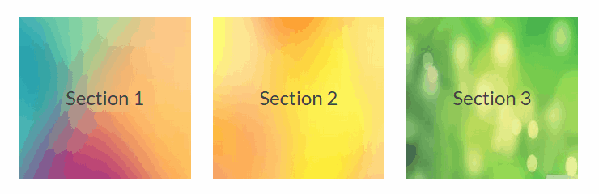

Hover Image Button - WordPress Plugin
=====================================

Create mobile responsive buttons with background images and pure CSS3 animated on hover effects. Include title and subtitle that appears when the user move the mouse hover the button. Recommended to be used as a page or section links.

Customize the color and the opacity of the background on hover effect, change the default buttons size and include your custom CSS code.



Add the shortcode to your page or post to create the buttons.

Shortcut Options:
-----------------

* *title*: title of the button, it is a h3 element.
* *subtitle*: appears when the user move the mouse hover the button.
* *link*: button link.
* *image*: background image link.
* *width*: button width.
* *height*: button height.

Examples:
--------

Multiple responsive buttons:

```text
[hover-image-row]
    [hover-image-button title="Section 1" subtitle="It's and amazing section" link="http://my-section-link" image="http://my-image-link" ]
    [hover-image-button title="Section 2" subtitle="Enter here for more info" link="http://my-section-link" image="http://my-image-link" ]
    [hover-image-button title="Section 3" subtitle="This is the best section" link="http://my-section-link" image="http://my-image-link" ]
[/hover-image-row]
```

Single button:

```text
[hover-image-button title="Section 1" subtitle="It's and amazing section" link="http://my-section-link" image="http://my-image-link" ]
```

Usage
-----

Upload the *hover-image-button* folder to your */wp-content/plugins* directory.

Or find it on the [official WordPress repository](https://wordpress.org/plugins/hover-image-button/).

License
-------

Licensed to GNU General Public License version 2 or later.

http://www.gnu.org/licenses/gpl-2.0.html
